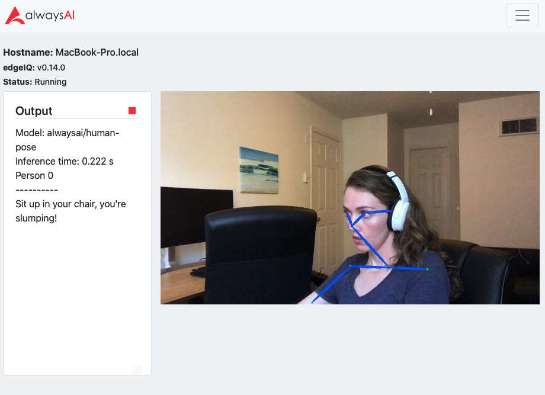
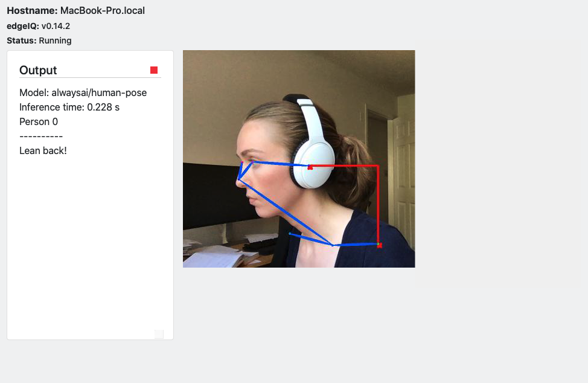

# Posture Corrector with Pose Estimation Example App
This app uses pose estimation to help users correct their posture by alerting them with a sound when they are slouching, leaning, or tilting their head down, as well as a printed message with specific suggestions for correcting posture. A **scale** variable is used to adjust the keypoints measurements for different individuals, accounting for greater or smaller natural distances between keypoints used to detect poor posture.


Currently, there are three branches in this repository.
* For a basic posture corrector app that works across platforms (Mac, Windows, Linux), pull the **master** branch.
* If you'd like to see how to markup streamer output and use custom audio file reminders, pull the **extras** branch (Note: you can replace the code that uses the audio file with the use of the 'print("\a")' used in **master** if you're not on a Mac, or use a different library to play the audio clip).
* If you'd like to run the application on a Jetson Nano (tested on a B01), pull the **nano** branch.

## Requirements
* [alwaysAI account](https://alwaysai.co/auth?register=true)
* [alwaysAI Development Tools](https://alwaysai.co/docs/get_started/development_computer_setup.html)

## Usage
Once the alwaysAI tools are installed on your development machine (or edge device if developing directly on it) you can install and run the app with the following CLI commands:

To perform initial configuration of the app:
```
aai app configure
```

To prepare the runtime environment and install app dependencies:
```
aai app install
```

To start the app:
```
aai app start
```

You should see output similar to that below.



If you run the **extras** branch, you will see additional markup on the image.



### Configuration
Add any configuration settings to ```config.json```. On the **extras** branch you will find that ```config.json``` holds an audio file in addition to ```scale```, but you can add any configurations you'd like to this file. The ```scale``` variable is one means of adjusting the sensitivity of the posture correction: increase this number for more relaxed requirements, and vice versa. You could customize the posture correction further with additional variables here.

## Support
* [Documentation](https://alwaysai.co/docs/)
* [Community Discord](https://discord.gg/alwaysai)
* Email: support@alwaysai.co

